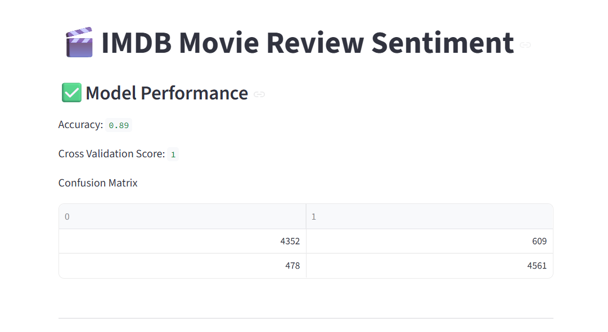
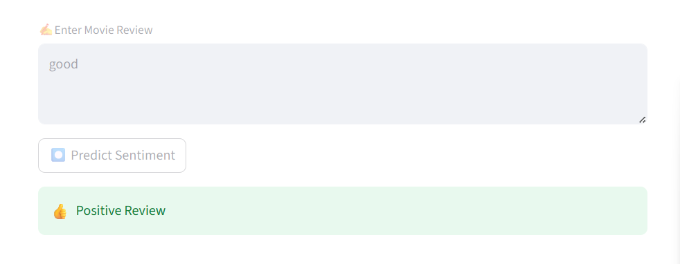

# 🎬 IMDb Movie Review Sentiment Analysis

## 📌 Project Explanation

This project is a Machine Learning-based web application that predicts whether a movie review is Positive or Negative using Natural Language Processing (NLP) and Logistic Regression.

The application processes movie reviews entered by users, cleans the text data, converts it into numerical vectors using TF-IDF Vectorization, and predicts the sentiment using a trained Logistic Regression model.

The project also includes model evaluation metrics such as Accuracy Score, Cross Validation Score, and Confusion Matrix to measure model performance.

This application is built using Streamlit, providing an interactive and user-friendly web interface for real-time sentiment prediction.

---

# 🚀 Features

- Real-time Movie Review Sentiment Prediction
- NLP-based Text Cleaning
- Stopword Removal
- TF-IDF Vectorization
- Logistic Regression Classification
- Interactive Streamlit Web Application
- Model Accuracy Evaluation
- Cross Validation Performance Check
- Confusion Matrix Visualization

---

# 🛠️ Technologies Used

## Programming Language
- Python

## Libraries & Frameworks
- Streamlit
- Pandas
- NLTK
- Scikit-learn
- Regular Expressions (re)

## Machine Learning Techniques
- Natural Language Processing (NLP)
- TF-IDF Vectorization
- Logistic Regression
- Train-Test Split
- Cross Validation

---

# 📊 Machine Learning Workflow

1. Data Collection
2. Data Cleaning
3. Text Preprocessing
4. Stopword Removal
5. TF-IDF Vectorization
6. Train-Test Split
7. Model Training
8. Model Evaluation
9. Sentiment Prediction

---

# 📈 Model Evaluation

The model performance is evaluated using:

- Accuracy Score
- Cross Validation Score
- Confusion Matrix

---

# 📷 Screenshots

## Application Interface



## Prediction Result



---

# ▶️ How to Run the Project

## Step 1 — Clone Repository

```bash
git clone https://github.com/yourusername/IMDB-Sentiment-Analysis.git
```

---

## Step 2 — Open Project Folder

```bash
cd IMDB-Sentiment-Analysis
```

---

## Step 3 — Install Required Libraries

```bash
pip install -r requirements.txt
```

---

## Step 4 — Run Streamlit Application

```bash
streamlit run ML_Deploy.py
```

---

# 📂 Project Structure

```text
IMDB-Sentiment-Analysis/
│
├── ML_Deploy.py
├── IMDB Dataset.csv
├── requirements.txt
├── README.md
├── .gitignore
└── screenshots/
    └── app.png
```

---

# 🔮 Future Improvements

- Deploy using Streamlit Community Cloud
- Improve UI/UX Design
- Add Deep Learning Models
- Add Sentiment Confidence Score
- Add Multiple Language Support

---

# 👨‍💻 Author

Boyana Vishnuvardan

```